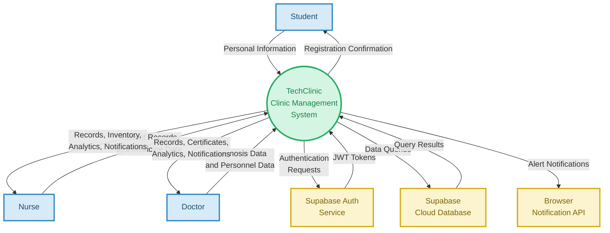

# TechClinic Context Diagram (DFD Level 0)
### Chapter 3: System Architecture

---

---

## Context Diagram Legend

| Shape | Color | Represents |
|-------|-------|-----------|
| **Rectangle** (blue) | `#D6EAF8` border `#2E86C1` | External Entity (User) |
| **Rectangle** (yellow) | `#FCF3CF` border `#D4AC0D` | External Service |
| **Double Circle** (green) | `#D5F5E3` border `#27AE60` | System Process (TechClinic) |
| **Arrow →** | — | Data Flow (labeled with data description) |

---

## External Entities

| Entity | Type | Description |
|--------|------|-------------|
| **Student** | User | TUP students who self-register at the clinic kiosk/tablet |
| **Nurse** | User | Clinic staff who manage patient records and medicine inventory |
| **Doctor** | User | Clinic staff who diagnose patients, manage personnel, generate certificates |
| **Supabase Auth Service** | External Service | Cloud authentication service (email/password, JWT tokens) |
| **Supabase Cloud Database** | External Service | Cloud-hosted PostgreSQL database (all data storage) |
| **Browser Notification API** | External Service | Web Push Notification API for outbreak/stock alerts |

---

## Data Flows Summary

### Inbound (→ System)
| From | Data | Description |
|------|------|-------------|
| Student | Personal Information | Student ID, name, department, contact, year level, sex, DOB, email, address |
| Nurse | Patient Record Data | Personal info + optional diagnosis, medication, treatment, notes |
| Nurse | Medicine Data | Medicine name, generic name, brand, type, dosage, unit, stock, batch, expiry |
| Nurse | Login Credentials | Email and password for authentication |
| Doctor | Diagnosis Data | Disease, medication (with quantity), treatment instructions, notes |
| Doctor | Personnel Data | Staff name, email, role, password for new user creation |
| Doctor | Login Credentials | Email and password for authentication |
| Doctor | Digital Signature | Signature image (drawn or uploaded) for certificates/prescriptions |
| Supabase Auth | JWT Token & Auth State | Authentication tokens and session validation results |
| Supabase DB | Query Results | Records, patients, medicines, diagnoses, notifications, analytics data |

### Outbound (System →)
| To | Data | Description |
|----|------|-------------|
| Student | Registration Confirmation / Auto-fill | Success message or pre-filled form data for returning students |
| Nurse | Patient Records & Visit History | Complete list of patient visit records with diagnoses |
| Nurse | Medicine Inventory & Stock Levels | Full medicine inventory with current stock counts |
| Nurse | Dashboard Statistics & Analytics | Stat cards, area charts, donut charts, pareto charts |
| Nurse | Outbreak Alerts & Stock Notifications | Disease threshold alerts and low-stock medicine warnings |
| Doctor | Incomplete Records | Records pending diagnosis for the doctor to complete |
| Doctor | Patient Records & Visit History | Complete patient records with diagnosis details |
| Doctor | Medical Certificates & Prescriptions | Printable clinic passes and prescription documents |
| Doctor | Personnel List | List of all clinic staff (nurses and doctors) |
| Doctor | Dashboard Statistics & Analytics | Stat cards and all analytics charts |
| Doctor | Outbreak Alerts & Stock Notifications | Disease threshold alerts and low-stock medicine warnings |
| Supabase Auth | Auth Requests | Sign-in, sign-out, and user creation requests |
| Supabase DB | SQL Queries | INSERT, SELECT, UPDATE, DELETE operations on all tables |
| Browser API | Push Notifications | System-level notifications for outbreaks and low stock |
