```mermaid
graph TD
    %% ============================================================
    %% PRESENTATION LAYER — USERS
    %% ============================================================
    subgraph PL["🖥️ PRESENTATION LAYER"]
        direction TB

        subgraph USERS["System Users"]
            direction LR
            STU["👨‍🎓 Student\n(Self-Registration Kiosk)"]
            NUR["👩‍⚕️ Nurse\n(Patient Management)"]
            DOC["👨‍⚕️ Doctor\n(Diagnosis & Personnel)"]
        end

        subgraph FRONTEND["React 19 + Vite Frontend — Port: 5173"]
            direction TB

            subgraph PAGES["Pages / Views"]
                direction LR
                Landing["Landing Page\n(Public Registration)"]
                Login["Login Page"]
                Dash["Dashboard"]
                PatRec["Patient Records"]
                IndRec["Individual Record"]
                NewPat["New Patient\n(Nurse)"]
                AddDx["Add Diagnosis\n(Doctor)"]
                MedInv["Medicine Inventory"]
                Analyt["Analytics"]
                Notif["Notifications"]
                Pers["Personnel List"]
                Sett["Settings"]
            end

            subgraph STORES["Zustand State Stores"]
                direction LR
                AuthSt["useAuthStore\n(Auth + User Profile)\n[localStorage]"]
                DataSt["useDataStore\n(Records + Patients)\n[localStorage]"]
                MedSt["useMedicineStore\n(Medicine CRUD)"]
                ChartSt["useChartStore\n(Analytics Data)"]
                NotifSt["useNotificationStore\n(Alerts + Polling)"]
            end

            subgraph SHARED["Shared Components"]
                direction LR
                Nav["Sidebar Navigation\n+ Notification Badge"]
                DxModal["Diagnosis Modal"]
                CertModal["Certificate Modal"]
                RxModal["Prescription Modal"]
                MedForm["Medicine Form Modal"]
                SigPad["Signature Pad"]
                ProtRoute["Protected Route\n(RBAC Guard)"]
            end

            subgraph CHARTS["Chart Components (ApexCharts)"]
                direction LR
                C1["Patient Counts\n(Area Chart)"]
                C2["Dept. Distribution\n(Donut Chart)"]
                C3["Top Diagnoses\n(Pareto Chart)"]
                C4["Low Stock Meds\n(Bar Chart)"]
            end
        end
    end

    %% ============================================================
    %% APPLICATION LAYER
    %% ============================================================
    subgraph AL["⚙️ APPLICATION LAYER — Express.js REST API — Port: 3500"]
        direction TB

        subgraph SECURITY["Security Middleware"]
            direction LR
            CORS["CORS\nMiddleware"]
            AuthMW["authenticate()\nJWT Verification"]
            AuthzMW["authorize(role)\nRBAC Enforcement"]
        end

        subgraph ROUTES["API Route Modules"]
            direction LR
            R1["authRoutes\n/api/auth/*"]
            R2["dataRoutes\n/api/records, patients,\npersonnel"]
            R3["medicineRoutes\n/api/medicines"]
            R4["analyticsRoutes\n/api/analytics"]
            R5["diseasesRoute\n/api/diseases"]
            R6["notificationRoutes\n/api/notifications"]
        end

        subgraph CTRL["Controllers (Business Logic)"]
            direction LR
            DC["dataController\n• insertRecord\n• getRecords\n• insertDiagnosis\n• insertPersonnel"]
            MC["medicineController\n• CRUD Operations\n• Stock Management"]
            AC["analyticsController\n• Weekly/Monthly/\n  Quarterly/Yearly\n• Dept. Aggregation"]
            DiC["diseasesController\n• Disease Catalog\n• Outbreak Stats"]
            NC["notificationController\n• Alert Threshold\n  Calculation\n• Low Stock Alerts\n• CRUD Notifications"]
        end
    end

    %% ============================================================
    %% DATA LAYER
    %% ============================================================
    subgraph DL["🗄️ DATA LAYER — Supabase Cloud Platform"]
        direction TB

        subgraph SBAUTH["Authentication Service"]
            direction LR
            SupAuth["Supabase Auth\n(Email/Password)\nJWT Token Issuance"]
        end

        subgraph SBDB["PostgreSQL Database"]
            direction LR
            T1["records\n(Visit Records)"]
            T2["patients\n(Unique Directory)"]
            T3["diagnoses\n(Medical Diagnoses)"]
            T4["diseases\n(Disease Catalog)"]
            T5["medicines\n(Inventory)"]
            T6["users\n(Clinic Staff)"]
            T7["notifications\n(Alert System)"]
        end

        subgraph SBSEC["Database Security"]
            direction LR
            RLS2["Row Level Security\n(RLS Policies)"]
        end

        subgraph SBSTORE["Storage"]
            direction LR
            SigBucket["Signatures Bucket\n(Digital Signatures)"]
        end
    end

    %% ============================================================
    %% USER → FRONTEND CONNECTIONS
    %% ============================================================
    STU -->|"Self-Registration"| Landing
    NUR -->|"Staff Access"| Login
    DOC -->|"Staff Access"| Login

    %% ============================================================
    %% INTERNAL FRONTEND CONNECTIONS
    %% ============================================================
    PAGES --> STORES
    PAGES --> SHARED
    Analyt --> CHARTS
    STORES -->|"HTTP Requests\n(Axios)"| ROUTES

    %% ============================================================
    %% FRONTEND → AUTH (Direct)
    %% ============================================================
    AuthSt -.->|"Direct Auth\n(signIn / signOut /\ngetUser)"| SupAuth

    %% ============================================================
    %% APPLICATION LAYER FLOW
    %% ============================================================
    ROUTES --> SECURITY
    SECURITY --> CTRL

    %% ============================================================
    %% BACKEND → DATABASE
    %% ============================================================
    DC -->|"Supabase JS\n(anon key)"| T1
    DC --> T2
    DC --> T3
    DC -->|"Supabase Admin\n(service role)"| T6
    MC --> T5
    AC --> T1
    AC --> T3
    DiC --> T4
    NC --> T3
    NC --> T5
    NC --> T7
    NC --> T6

    %% ============================================================
    %% TABLE RELATIONSHIPS
    %% ============================================================
    T1 ---|"student_id"| T2
    T3 ---|"record_id → records.id"| T1
    T3 ---|"disease_id → diseases.id"| T4
    T7 ---|"user_id → users.id"| T6

    %% ============================================================
    %% SECURITY LAYER
    %% ============================================================
    SBDB --> RLS2
    T6 -.-> SupAuth
    SigPad -.->|"Upload"| SigBucket

    %% ============================================================
    %% STYLING
    %% ============================================================
    classDef presLayer fill:#EBF5FB,stroke:#2980B9,stroke-width:3px,color:#154360
    classDef appLayer fill:#EAFAF1,stroke:#27AE60,stroke-width:3px,color:#1E8449
    classDef dataLayer fill:#FEF9E7,stroke:#F39C12,stroke-width:3px,color:#7D6608

    classDef userBox fill:#D4E6F1,stroke:#2E86C1,stroke-width:2px,color:#1B4F72
    classDef pageBox fill:#AED6F1,stroke:#2980B9,stroke-width:2px,color:#1A5276
    classDef storeBox fill:#85C1E9,stroke:#2471A3,stroke-width:2px,color:#154360
    classDef compBox fill:#A9CCE3,stroke:#2980B9,stroke-width:1.5px,color:#1A5276
    classDef chartBox fill:#7FB3D8,stroke:#2471A3,stroke-width:1.5px,color:#154360

    classDef secBox fill:#82E0AA,stroke:#1E8449,stroke-width:2px,color:#145A32
    classDef routeBox fill:#A9DFBF,stroke:#27AE60,stroke-width:2px,color:#186A3B
    classDef ctrlBox fill:#7DCEA0,stroke:#229954,stroke-width:2px,color:#1E8449

    classDef authBox fill:#F9E79F,stroke:#D4AC0D,stroke-width:2px,color:#7D6608
    classDef tableBox fill:#FAD7A0,stroke:#E67E22,stroke-width:2px,color:#784212
    classDef rlsBox fill:#F5CBA7,stroke:#CA6F1E,stroke-width:2px,color:#6E2C00
    classDef storageBox fill:#FDEBD0,stroke:#E67E22,stroke-width:1.5px,color:#784212

    class PL presLayer
    class AL appLayer
    class DL dataLayer

    class STU,NUR,DOC userBox
    class Landing,Login,Dash,PatRec,IndRec,NewPat,AddDx,MedInv,Analyt,Notif,Pers,Sett pageBox
    class AuthSt,DataSt,MedSt,ChartSt,NotifSt storeBox
    class Nav,DxModal,CertModal,RxModal,MedForm,SigPad,ProtRoute compBox
    class C1,C2,C3,C4 chartBox

    class CORS,AuthMW,AuthzMW secBox
    class R1,R2,R3,R4,R5,R6 routeBox
    class DC,MC,AC,DiC,NC ctrlBox

    class SupAuth authBox
    class T1,T2,T3,T4,T5,T6,T7 tableBox
    class RLS2 rlsBox
    class SigBucket storageBox
```

# TechClinic System Architecture — Detailed View
### Chapter 3: System Architecture (Detailed Component Diagram)

---



---

## Detailed Architecture Breakdown

### Presentation Layer (Blue Border — `#2980B9`)

| Sub-layer | Components | Description |
|-----------|-----------|-------------|
| **Users** | Student, Nurse, Doctor | Three user roles with distinct access levels |
| **Pages** | 12 page components | Landing Page (public), Login, Dashboard, Patient Records, Individual Record, New Patient, Add Diagnosis, Medicine Inventory, Analytics, Notifications, Personnel List, Settings |
| **State Stores** | 5 Zustand stores | useAuthStore (persisted), useDataStore (persisted), useMedicineStore, useChartStore, useNotificationStore |
| **Shared Components** | 7 reusable components | Sidebar Navigation, Diagnosis Modal, Certificate Modal, Prescription Modal, Medicine Form, Signature Pad, Protected Route Guard |
| **Charts** | 4 ApexCharts components | Patient Counts (Area), Department Distribution (Donut), Top Diagnoses (Pareto), Low Stock Medicines (Bar) |

### Application Layer (Green Border — `#27AE60`)

| Sub-layer | Components | Description |
|-----------|-----------|-------------|
| **Security Middleware** | CORS, authenticate(), authorize() | JWT token verification + role-based access control enforcement |
| **API Routes** | 6 route modules | authRoutes, dataRoutes, medicineRoutes, analyticsRoutes, diseasesRoute, notificationRoutes |
| **Controllers** | 5 controllers | dataController (records/patients/diagnoses/personnel), medicineController (CRUD + stock), analyticsController (time-series aggregation), diseasesController (catalog + stats), notificationController (outbreak alerts + low stock) |

### Data Layer (Amber/Orange Border — `#F39C12`)

| Sub-layer | Components | Description |
|-----------|-----------|-------------|
| **Authentication** | Supabase Auth | Email/password auth, JWT token issuance |
| **Database** | 7 PostgreSQL tables | records, patients, diagnoses, diseases, medicines, users, notifications |
| **Security** | Row Level Security | RLS policies enforcing role-based data access at the database level |
| **Storage** | Signatures Bucket | Digital signature image storage for doctors |

### Key Data Relationships
| From | To | Relationship |
|------|-----|-------------|
| `records` | `patients` | student_id (many records → one patient) |
| `diagnoses` | `records` | record_id → records.id (many diagnoses → one record) |
| `diagnoses` | `diseases` | disease_id → diseases.id (many diagnoses → one disease) |
| `notifications` | `users` | user_id → users.id (many notifications → one user) |
| `users` | `Supabase Auth` | id matches Supabase Auth user ID |

### 3-Layer Security Model
```
Layer 3: Frontend (ProtectedRoute + Conditional Rendering)
    ↓ HTTP + Bearer Token (JWT)
Layer 2: Backend (authenticate() + authorize() middleware)
    ↓ Supabase JS SDK
Layer 1: Database (Row Level Security policies)
```
