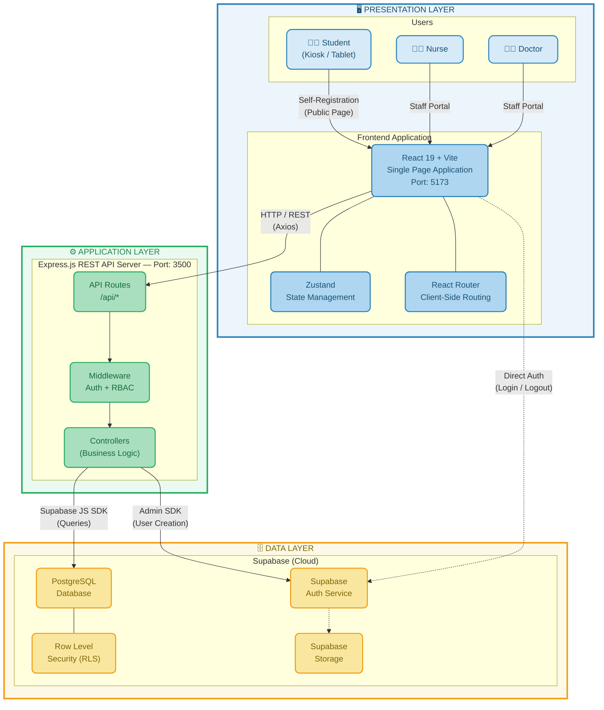

# TechClinic System Architecture — High-Level Overview
### Chapter 3: System Architecture

---

---

## Architecture Summary

| Layer | Technology | Purpose |
|-------|-----------|---------|
| **Presentation** | React 19, Vite, Tailwind CSS, Zustand, React Router | User interface for students, nurses, and doctors |
| **Application** | Node.js, Express.js v5, CORS, JWT Middleware | REST API server handling business logic and RBAC |
| **Data** | Supabase (PostgreSQL), Supabase Auth, RLS, Storage | Cloud-hosted database, authentication, and file storage |

### Communication Protocols
- **Frontend → Backend:** HTTP/REST via Axios (JSON)
- **Frontend → Supabase Auth:** Direct connection (login/logout only)
- **Backend → Database:** Supabase JS SDK (anon key for queries, service role key for admin operations)

### Color Legend
| Color | Layer |
|-------|-------|
| 🔵 Blue border | Presentation Layer (Client-side) |
| 🟢 Green border | Application Layer (Server-side) |
| 🟡 Amber/Orange border | Data Layer (Database & Cloud Services) |
